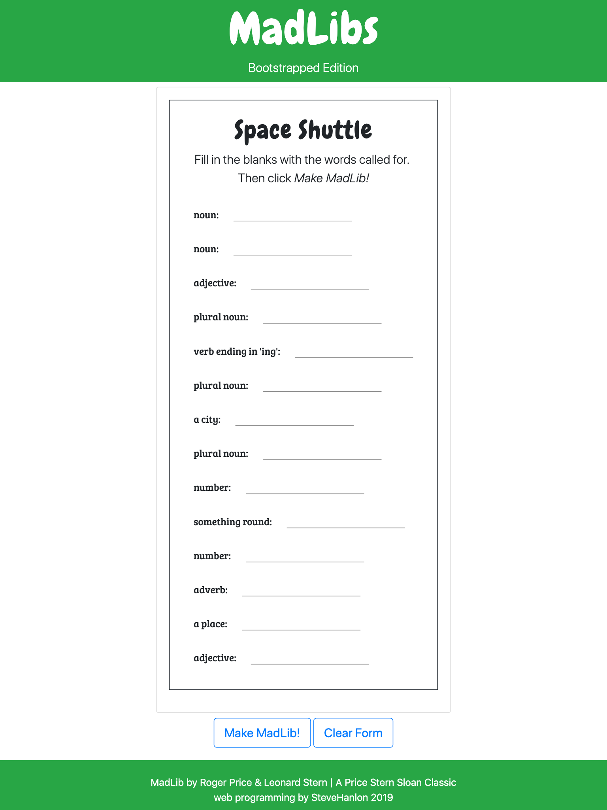

## Mad Libs

#### Intro
Title: It All Makes Sense on Planet Shishkabob - The Mad-Lib-Maker App

by Steve Hanlon

**It All Makes Sense on Planet Shishkabob** is a MadLib app

##### Technical Components
- Bootstrap 4.3  
- JavaScript (ECMASript 6)
- React 16.8.3

##### Attribution
[MadLib by Roger Price & Leonard Stern | A Price Stern Sloan Classic]()

#### Pictures of Responsive Design
###### Phone

###### Tablet

###### Desktop

#### Future Features
- Add more MadLibs with linked ToC to pick one
- Add API to check whether or not grammar rules are satisfied by person filling out the form
